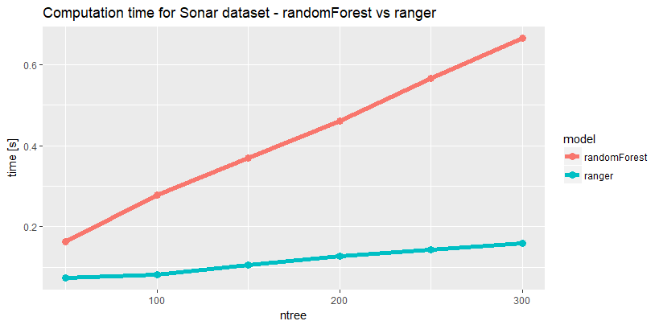
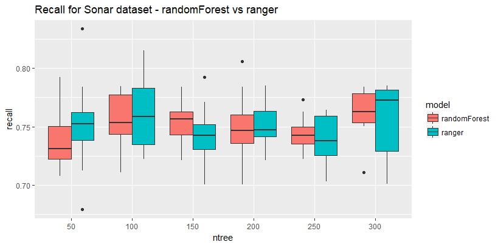

ranger
========================================================
author: Kamil Romaszko
date: 09.05.2018
autosize: true

Authors
========================================================

Features
========================================================

 - Good performance for High Dimensional Data
 - Memory efficiency 
 - Variable importance
 - Classification, regression and survival trees
 
Performance for high dimensional dataset
========================================================
 

Experiment - computation time
========================================================

Experiment - prediction error
========================================================

Prediction error
========================================================

Importance randomForest vs ranger
========================================================

Bibliography
========================================================
Marvin N. Wright, Andreas Ziegler(2017). ranger: A Fast Implementation of Random Forests for High Dimensional Data in C++ and R

